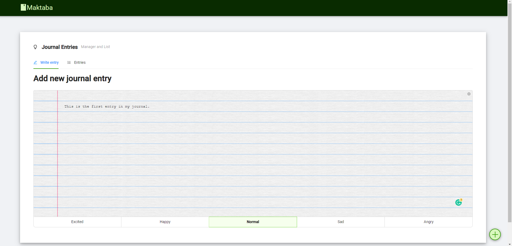
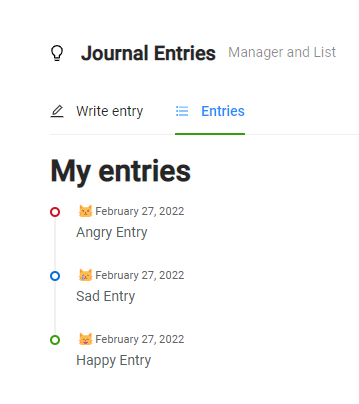

## **Almer TM**

🧑‍💻 Full-Stack Web Engineer at [Thinking Machines](https://thinkingmachin.es/)

🕸️ Uses Python and JavaScript

🐈 Has three cats

## Github Stats

  
🗔 Random apps that I have deployed

  - [Journaling Application that saves to local storage](https://maktabajournal.netlify.app/)

  

    
    
  

  *Screenshots of Application*

  - [Open sites in draggable containers](https://dragtab.netlify.app/)
  - [Tic-Tac-Toe](https://mamer-tictactoe.netlify.app/)

